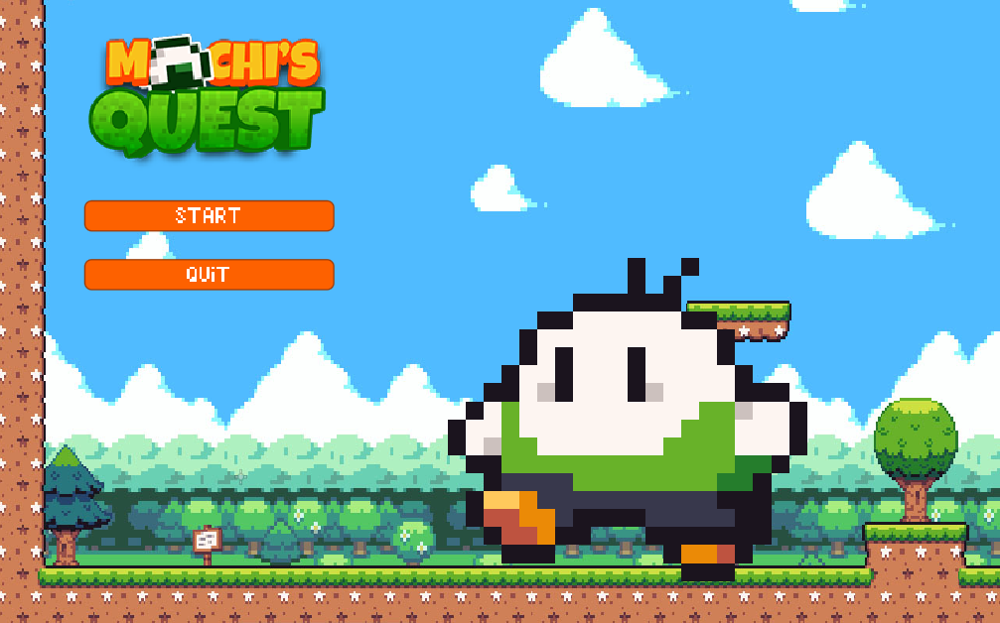
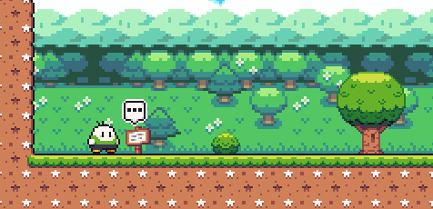
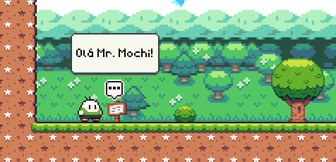
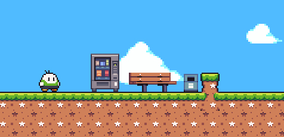
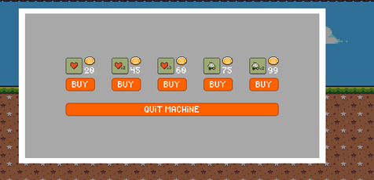
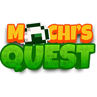

<h1>Mochi Quest</h1>

Viaje por 4 cenários diferentes e enfrente criaturas para salvar seu amigo Onion, que ficou preso no fundo de uma caverna!

Neste jogo de plataforma 2d, você encontrará desafios pelo mapa para poder avançar no jogo, encontrando diferentes tipos de criaturas, cada uma com suas particularidades, enquanto coleta moedas que podem ser usadas para comprar corações ou vidas.

Para jogar, acesse o link a seguir: LINK EM BREVE

<h2> Controles do Jogo </h2>

- Setas ou WASD: movem o personagem;
- Espaço: pula;
- ESC: pausa o jogo;
- Z ou Q: interaje com determinados componentes do jogo;
- X ou E: avançam nas mensagens das placas;
- Botão esquerdo do mouse: clica em botões pelo jogo.

<h2> Mecânicas do Jogo </h2>

Sempre que você visualizar uma dessas placas no jogo com esse ícone acima delas, significa que há uma mensagem para ser lida! Aperte Z ou Q e interaja com o cenário.

Leia as mensagens com calma e avance apertando X ou E. Quando chegar ao final, o pop-up desaparece. Você também pode fechar as mensagens se afastando da placa.

Em algumas fases do jogo, você poderá encontrar essas máquinas de venda e assim como as placas, quando aparecer um ícone acima delas, significa que você pode interagir com elas apertanto Z ou Q.

Ao interagir com uma máquina de vendas, se abrirá uma nova janela onde você poderá usar o seu gold coletado para comprar corações ou mais vidas para o Mr. Mochi. Para comprar um item, clique com o botão esquerdo do mouse ou clicar em "Quit Machine" para encerrar suas compras.

<h2>Tecnologias</h2>

<h2>Conecte-se comigo!</h2>

<h2> Créditos </h2>

Todos os créditos dos assets usados tanto de imagem quanto de som pertencem aos seus respectivos criadores.

